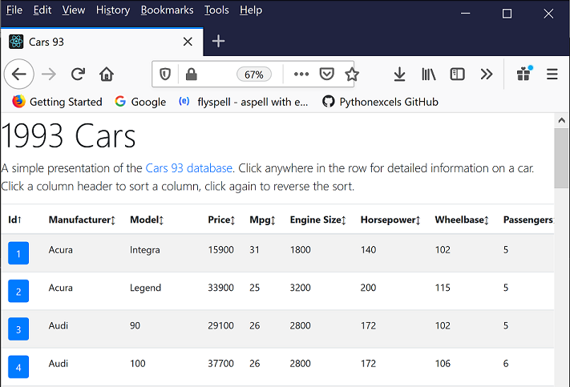

# Cars93Client

This is a simple, front end for the Cars93 API Endpoint server at [https://github.com/danwritesandcodes/Cars93APIEndpoint](https://github.com/danwritesandcodes/Cars93APIEndpoint). The application is written using the React JavaScript library and requires NodeJS to build.

## Features

* Mobile-ready

* 


## Prerequisites

This application requires NodeJS. To install NodeJS, see [https://nodejs.org](https://nodejs.org) for more information.

## Testing

After installing NodeJS and downloading this repository, do the following to test the application:

1. Install the required NodeJS packages

    ```
    $ npm install
    > core-js@2.6.11 postinstall ...
    > core-js@3.6.0 postinstall ...
    ...
    found 0 vulnerabilities
    ```

2. Start the development server

    ```
    $ npm start
    > reactbootstrapdatatables@0.1.0 start /home/user/ReactTest/React
    > react-scripts start
    ...
    : Project is running at http://0.0.0.0:3000/
    ```

    The `npm start` command compiles the project, opens a web browser, and loads http://0.0.0.0:3000 to preview the project. Any changes to the Javascript, HTML, and CSS files in the project are automatically compiled and reloaded.



## Building

To compile the project into a set of static files, use `npm run build`.

```
$ npm run build
> reactbootstrapdatatables@0.1.0 build /home/user/ReactTest/React
> react-scripts build
...
```
Npm compiles the source, compresses the output files, and writes the content to the build folder.


